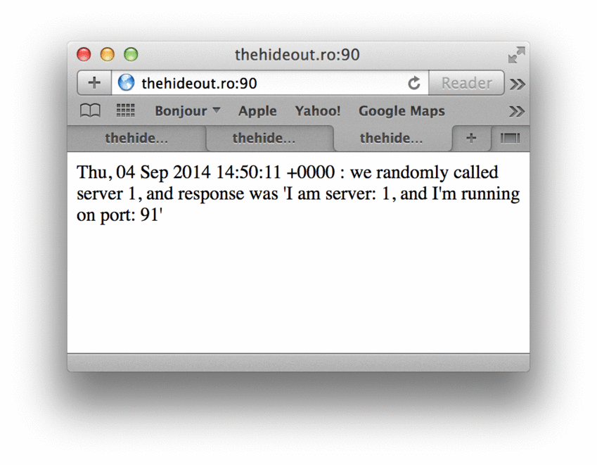

So this is how *random* loadbalancing happens between a couple of simple HTTP webservers

! requires the "bottle" framework though, get it at: [bottlepy.org](https://bottlepy.org), son !
It can obviously be avoided with simpleHTTPserver but I wanted easier routing and shit, sue me :P

Usage:
-----
try to fire up index.py a bunch of times until your beloved RNG gods happen to coin-flip the numbers 1 and 2,
so these small instances can run on the same machine on different ports, to emulate having separate HTTP servers

```bash
johndoe@thehideout:/path/to/my/shit# ./index.py
Bottle v0.12.7 server starting up (using WSGIRefServer())...
Listening on http://0.0.0.0:91/
Hit Ctrl-C to quit.
```

and then the same but in a different terminal/screen/tmux/window/whatever (and no, backgrounding it won't respond to requests :/)

```bash
johndoe@thehideout:/path/to/my/shit# ./index.py
Bottle v0.12.7 server starting up (using WSGIRefServer())...
Listening on http://0.0.0.0:92/
Hit Ctrl-C to quit.
```

and then fire up lb.py as the main url endpoint listener and loadbalancer...
```bash
johndoe@thehideout:/path/to/my/shit# ./lb.py
Bottle v0.12.7 server starting up (using WSGIRefServer())...
Listening on http://0.0.0.0:90/
Hit Ctrl-C to quit.
```

and finally, fire up your favorite browser and hit it like you mean it (meaning: refresh like a stale mofo :P)

Here's how it looks when it's run:
----------------------------
<p align="center">

</p>
